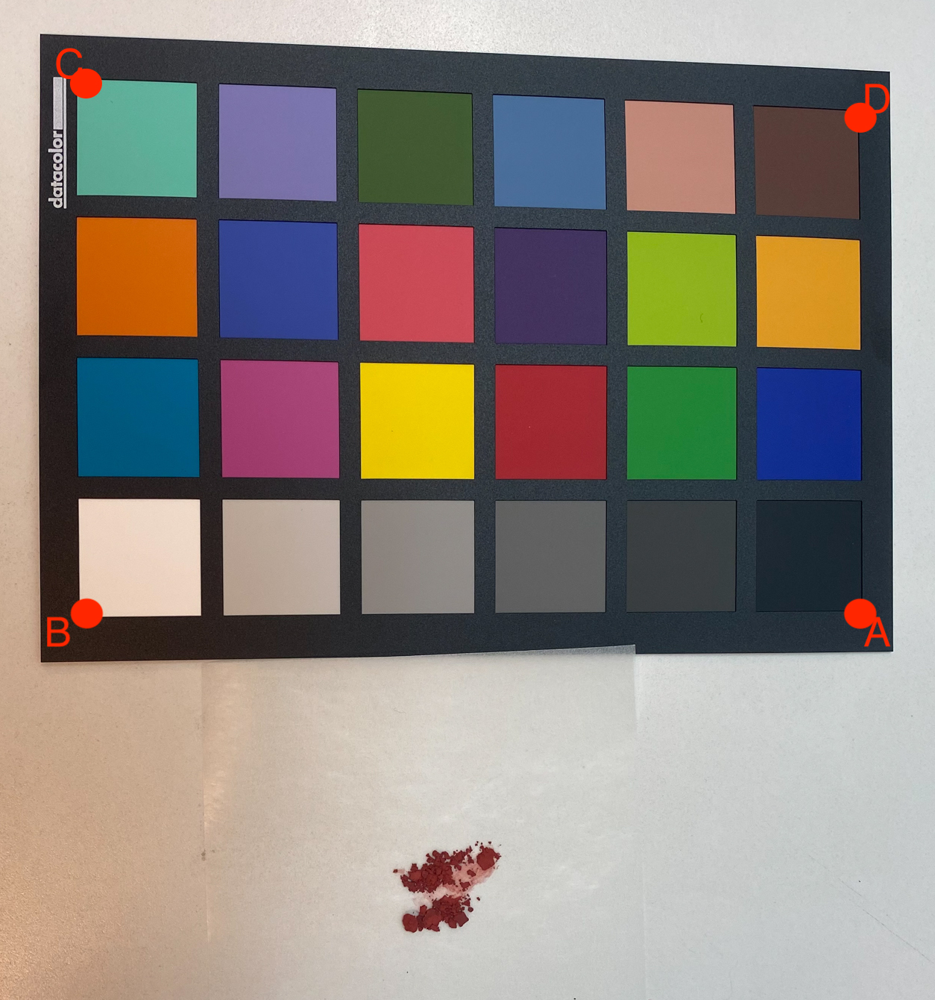

# colorcal

[![NPM version][npm-image]][npm-url]
[![build status][ci-image]][ci-url]
[![npm download][download-image]][download-url]

Calibrate the color of images using a color calibration card on the same photo.



The approach is semi-automatic. After picking the edges (A, B, C, D---always starting with the black outer edge and then moving to white, turquoise and blue for the SyderChecker24) of the color calibration card, the rest should happen automatically.

RGB values copied from a [Github repo](https://github.com/G1teste/antonio/blob/8d91d348d8eb56d6379b5058dda2793a10909dd9/Catalano.Image/src/Catalano/Imaging/Tools/ColorCard.java) and not verified so far.

Open source implementation of [Color calibration of digital images for agriculture and other applications](https://www.sciencedirect.com/science/article/pii/S0924271618302600) to be used directly in [ELN](eln.epfl.ch).

The code can deal with moderate tilt and rotation of the card (as shown in the example image). Rotation should be much more robust than tilt, hence please try to shoot your images such that the plane of the camera and the card are parallel to each other.

## Installation

`$ npm i colorcal`

## Usage

```js
import library from 'colorcal';

const result = library(args);
// result is ...
```

## [API Documentation](https://cheminfo.github.io/colorcal/)

## License

[MIT](./LICENSE)

[npm-image]: https://img.shields.io/npm/v/colorcal.svg
[npm-url]: https://www.npmjs.com/package/colorcal
[ci-image]: https://github.com/cheminfo/colorcal/workflows/Node.js%20CI/badge.svg?branch=master
[ci-url]: https://github.com/cheminfo/colorcal/actions?query=workflow%3A%22Node.js+CI%22
[download-image]: https://img.shields.io/npm/dm/colorcal.svg
[download-url]: https://www.npmjs.com/package/colorcal
